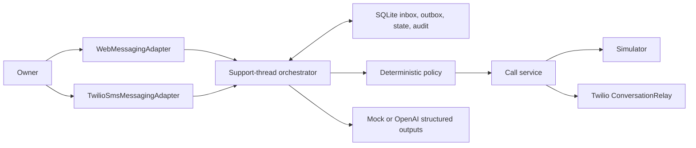

# Liaison

Liaison is an accessible, self-hosted support-call agent for one owner. Start in a secure text thread or by SMS, describe a low-risk customer-support problem in ordinary language, inspect the plan and authority, authorize exactly one call with a short-lived `CALL <code>`, and supervise the call entirely through text.

The core invariant is simple: no important information, warning, request, decision, commitment, or call state exists only in audio.

Liaison is free software under the [GNU Affero General Public License v3.0](LICENSE). It is a personal-instance application, not a hosted SaaS, call center, campaign messenger, or general-purpose autonomous caller.

## How it works

1. Send a natural-language request through the authenticated web thread or the configured owner SMS number.
2. Liaison asks concise questions for genuinely missing information. It never discovers or invents a support number.
3. Review the versioned plan, destination, goal, autonomy mode, authority, conditional limits, prohibited actions, and uncertainty.
4. Reply `APPROVE PLAN`. Liaison issues a random, expiring, single-use code bound to that approved plan, destination, and call mode.
5. Reply exactly `CALL <code>` when you are available. Nothing else starts the call.
6. Follow semantic text updates instead of an audio-only experience. Pause, resume, steer privately, request exact safe speech, or use a confirmed hang-up command.
7. Resolve narrow low-consequence choices with `A`, `B`, or `C`. Sensitive and material decisions move to an authenticated, short-lived, single-use web action. Prohibited actions have no approval path.
8. Receive a terminal result with verified commitments and exact transcript evidence. Unsupported conclusions remain unresolved.

## What is implemented

- A unified secure web-messaging thread and optional owner-allowlisted Twilio SMS surface.
- Natural-language case collection with explicit missing fields and deterministic command parsing before model interpretation.
- Inspectable support-thread states, plan versions, `ASSIST` / `COPILOT` / `DELEGATE` modes, authority envelopes, conditional rules, attention tiers, commitments, disclosures, and outcomes.
- Exact short-lived call authorization stored as a one-way hash, invalidated by relevant plan or mode changes, and consumed transactionally once.
- A durable SQLite inbox, outbox, audit history, work claims, delivery events, and restart recovery in one deployable process.
- Provider-neutral `WebMessagingAdapter` and `TwilioSmsMessagingAdapter` boundaries plus simulator and Twilio telephony adapters.
- SMS segment estimation and composition that preserves required action, expiry, amount, consequence, and secure-link fragments before optional detail.
- Twilio inbound/status signature validation, account/destination checks, exact owner allowlisting, duplicate-message handling, delivery reduction, opt-out state, and MMS rejection without downloading media.
- A tested call state machine, speaker-labeled redacted transcript, semantic updates, pause/resume, private steering, exact text, interruption invalidation, attention handling, and safe termination.
- Optional Twilio Calls API plus `<Connect><ConversationRelay>` with signed HTTP callbacks, signed WebSocket setup, identity checks, DTMF, speech, interruption handling, and terminal status processing.
- Optional OpenAI Responses API planning, control, and outcome extraction using strict Zod structured outputs. Deterministic mock mode remains the default.
- Evidence-grounded reports, commitments, JSON/text export, and a dedicated complete messaging-workflow simulator scenario.
- Keyboard operation, semantic status, visible focus, urgent-focus movement, large text, high contrast, reduced motion, responsive layouts, and text-only status parity.
- Interactive setup, a no-provider doctor, protocol schema generation, deterministic messaging demo, Docker/Compose, Railway configuration, retention tooling, CI, and operator documentation.

## Quick start: no credentials and no provider charges

Requirements: Node.js 22 or newer.

```bash
npm ci
npm run setup -- --defaults --output=.env
npm run doctor
npm run dev
```

`npm run setup` creates independent local secrets and prints the generated access key once. Store that key, then open `http://localhost:3000` and sign in. The non-interactive defaults are:

```text
LLM_MODE=mock
MESSAGING_MODE=web
ALLOW_REAL_MESSAGING=false
TELEPHONY_MODE=simulator
ALLOW_REAL_CALLS=false
```

This path does not call OpenAI, send SMS, or place a telephone call. It uses the same support-thread state, plan authority, durable message store, policy, call service, attention flow, and outcome compiler used by provider modes.

On Windows PowerShell, the commands are the same. If you prefer to configure every field interactively, run `npm run setup` without `--defaults`.

### Run the deterministic vertical slice

```bash
npm run demo:messaging
```

The demo exercises the text-first workflow in web/mock/simulator modes and exits without external provider requests. It is useful for installation checks and regression evidence; it is not a live Twilio test.

### Try the browser thread

Send one message containing synthetic details, for example:

```text
I need Acme support at +12025550123. A replacement shipment never arrived.
The order was placed last Tuesday. I want a replacement with a confirmed delivery date.
```

Liaison will ask for anything still required, return an inspectable plan, and wait for `APPROVE PLAN`. When it supplies a code, copy the exact `CALL <code>` command into the thread to run the dedicated messaging simulator scenario.

Use only synthetic information in development. Do not use a real account, representative, or destination without permission.

## Messaging commands

Commands are case-insensitive after surrounding whitespace is removed and are parsed before natural-language model classification.

| Command | Effect |
| --- | --- |
| `NEW` | Begin a new support request. |
| `STATUS` | Return current thread, case, call, and attention status. |
| `EDIT` or `LINK` | Open the authenticated web surface for review or editing. |
| `APPROVE PLAN` | Approve the current plan and issue a one-time call code. |
| `CALL <code>` | Start only the exact approved plan bound to that code. |
| `A`, `B`, or `C` | Resolve the one pending, unexpired low-consequence choice. |
| `MODE ASSIST` | Require owner-authored substantive responses. |
| `MODE COPILOT` | Ask on consequential or ambiguous choices. This is the default. |
| `MODE DELEGATE` | Proceed inside approved authority and ask at hard boundaries. |
| `PAUSE` / `RESUME` | Pause or resume autonomous call replies while transcription continues. |
| `SAY: <text>` | Request exact speech after deterministic safety checks. |
| `HANGUP`, then `HANGUP YES` | Request and confirm call termination. |
| `CANCEL` | Cancel preparation; it does not silently terminate an active call. |
| `STOP` / `START` / `HELP` | Manage messaging consent or request concise help. `STOP` does not hang up a call. |

Autonomy modes change interaction frequency, never authority. Hard-denied actions remain denied in every mode.

## Attention and authority

Deterministic code assigns the final tier for a proposed action:

| Tier | Owner interaction |
| --- | --- |
| `INFORMATIONAL` | Concise semantic update; no decision. |
| `LOW_CONSEQUENCE` | Exact A/B/C choice may be accepted through SMS or web while pending and unexpired. |
| `SENSITIVE` | Authenticated secure web review; never resolved by SMS. |
| `MATERIAL` | Authenticated secure web review plus explicit confirmation. |
| `PROHIBITED` | Refused; no link, mode, or owner message can approve it. |

Passwords, one-time codes, full payment-card information, full Social Security numbers, PINs, security answers, recovery codes, purchases, new contracts, impersonation, and waiver of legal rights are prohibited. Emergency, medical, legal, financial, insurance, government, debt, employment, immigration, and law-enforcement workflows are outside the product's supported scope.

## Architecture

Liaison is a modular monolith: one Fastify process owns authentication, the messaging orchestrator and worker, deterministic policy, call supervision, Twilio callbacks/WebSockets, SSE, SQLite, and the React client.



Inbound messages are persisted before interpretation. Inbound work receives bounded retries and then becomes inspectable dead-letter work. Outbound intents are persisted before submission, but ambiguous provider-send failures are deliberately not retried automatically because the provider may already have accepted the SMS; the failed row remains visible for operator review. An expired inbound-work lease can be reclaimed, while an expired outbound-send lease becomes an `UNKNOWN` dead letter and is never automatically resent. The system therefore does not claim impossible exactly-once carrier semantics.

Delivery callbacks can be late, duplicated, or reordered. Liaison reduces them by semantic progression and retains failure detail. Provider `accepted` or `queued` means accepted for processing, not delivered to the owner's handset.

See [Architecture](docs/ARCHITECTURE.md), [Messaging protocol](docs/MESSAGING_PROTOCOL.md), and [Provider adapters](docs/PROVIDER_ADAPTERS.md).

## Self-hosting and Docker

For a production deployment, use [SELF_HOSTING.md](docs/SELF_HOSTING.md) and the [deployment checklist](docs/DEPLOYMENT_CHECKLIST.md). The included Compose file runs one app service and one named SQLite volume—no Redis or external database.

```bash
docker compose build
docker compose up -d
```

Before using Compose, copy `.env.example` to `.env`, replace all production secrets, set exact public HTTPS/WSS origins, and keep both real-use flags false. Production refuses missing core secrets or plain HTTP/WSS public origins. Put Liaison behind a trusted TLS reverse proxy; `examples/Caddyfile` is an optional starting point.

SQLite must be on persistent writable storage. Back it up with a stopped-volume snapshot or SQLite online-backup tooling, encrypt and retain backups deliberately, and test restoration with provider use disabled.

## Optional Twilio SMS and voice

Follow [TWILIO_SETUP.md](docs/TWILIO_SETUP.md) rather than enabling everything at once.

Twilio SMS uses these exact public POST endpoints:

```text
/webhooks/twilio/messaging/inbound
/webhooks/twilio/messaging/status
```

Live messaging requires the owner E.164 number, Twilio credentials, a Messaging Service SID or SMS sender, `MESSAGING_MODE=twilio_sms`, and `ALLOW_REAL_MESSAGING=true`.

Voice callbacks use short-lived signed-token paths:

```text
/webhooks/twilio/voice/<signed-token>
/webhooks/twilio/status/<signed-token>
/webhooks/twilio/conversation-action/<signed-token>
/webhooks/twilio/conversation-relay/<signed-token>
```

Live voice requires completed ConversationRelay onboarding, Twilio credentials and a voice sender, `TELEPHONY_MODE=twilio`, and `ALLOW_REAL_CALLS=true`.

Twilio signs the exact URL it requests. `PUBLIC_BASE_URL` / `PUBLIC_WSS_URL` and reverse-proxy behavior must match the external scheme, host, port, path, and encoded query. Do not disable signature validation to work around a mismatch.

## Security, privacy, and cost boundaries

- Liaison accepts one configured SMS owner and one authenticated browser principal. It is not multi-tenant identity infrastructure.
- SMS is carrier-visible and possession of a phone number is weaker than cryptographic identity. Sensitive and material decisions stay in the authenticated web app.
- `STOP` records an opted-out state. The worker refuses later unsent Twilio submissions and marks such claimed rows failed; it cannot recall a message already accepted by Twilio or a carrier.
- Inbound MMS is rejected and media is not downloaded.
- Prohibited credential patterns are replaced before persistence, logging, model input, or orchestration. Pattern matching cannot detect every secret.
- The application does not request call recording or intentionally retain audio. Twilio ConversationRelay and its speech providers necessarily process telephone audio.
- Temporary supported disclosure values live only in server memory and are excluded from SQLite, models, SMS, SSE, ordinary logs, and stored transcripts. Restart deliberately loses them.
- The current US-number and keyword risk checks are safety layers, not proof that a destination or issue is appropriate.
- There is one active call, a daily cap, a hard duration, no scheduled/background calling, no automatic call retry, and no redial.
- SMS segment and call-minute costs are configurable estimates, not invoices. Provider pricing, registration, number rental, taxes, carrier fees, and model tokens remain the operator's responsibility.

Read [Application security](docs/SECURITY.md), [Security reporting](SECURITY.md), [Privacy](docs/PRIVACY.md), and [Costs](docs/COSTS.md) before enabling providers.

## Validation and live-provider boundary

The repository includes unit tests for policy, protocol, state, messaging adapters, composition, delivery reduction, database durability, authorization, and telephony; integration tests for authentication and deterministic simulator scenarios; a Playwright browser workflow; production builds; and container CI.

Run:

```bash
npm run check
npm run test:e2e
npm run demo:messaging
docker build --tag liaison:local .
```

Automated tests use mock clients, signed synthetic requests, web messaging, and the simulator. They do not register a sender, send a carrier SMS, place a PSTN call, verify a Twilio account's ConversationRelay terms, prove handset delivery, spend OpenAI credits, or validate a particular deployment's TLS/proxy configuration. Passing tests are not live Twilio validation. Record real-provider evidence separately and only from owned or consenting destinations.

The pre-migration preservation point and its exact results are recorded in [MIGRATION_BASELINE.md](docs/MIGRATION_BASELINE.md). Current release results should be reported from the commands actually run against the current revision, not inferred from that baseline.

## Commands

| Command | Purpose |
| --- | --- |
| `npm run setup` | Interactively generate `.env`, independent secrets, and safe provider defaults. |
| `npm run doctor` | Check runtime/configuration/database prerequisites without provider or model calls. |
| `npm run dev` | Run Fastify with Vite development middleware. |
| `npm run demo:messaging` | Run the deterministic no-provider messaging vertical slice. |
| `npm run protocol:generate` | Generate protocol v1 JSON Schemas and validate checked-in examples. |
| `npm run lint` | Run ESLint. |
| `npm run typecheck` | Type-check client, server, and tool projects. |
| `npm run test:unit` | Run unit tests. |
| `npm run test:integration` | Run integration and simulator tests. |
| `npm run test:e2e` | Run the Playwright browser workflow. |
| `npm run check` | Lint, type-check, run Vitest, and build production artifacts. |
| `npm run build` | Build the React client and Node.js server. |
| `npm start` | Run the production build. |
| `npm run retention` | Delete eligible completed cases in source mode. |
| `npm run retention:production` | Run retention from the production build. |

## Documentation

- [Self-hosting](docs/SELF_HOSTING.md)
- [Twilio setup](docs/TWILIO_SETUP.md)
- [Deployment checklist](docs/DEPLOYMENT_CHECKLIST.md)
- [Architecture](docs/ARCHITECTURE.md)
- [Messaging protocol](docs/MESSAGING_PROTOCOL.md)
- [Universal Support Protocol](docs/UNIVERSAL_SUPPORT_PROTOCOL.md)
- [Provider adapters](docs/PROVIDER_ADAPTERS.md)
- [Design principles](docs/DESIGN_PRINCIPLES.md)
- [Security](docs/SECURITY.md)
- [Privacy](docs/PRIVACY.md)
- [Costs](docs/COSTS.md)
- [Roadmap and explicit non-goals](docs/ROADMAP.md)
- [Future open-source voice research](docs/OPEN_SOURCE_VOICE_MIGRATION.md)
- [Changelog](CHANGELOG.md)

See [CONTRIBUTING.md](CONTRIBUTING.md) for the mock-first contribution workflow and [SUPPORT.md](SUPPORT.md) for community support boundaries. Report vulnerabilities privately through [SECURITY.md](SECURITY.md).
