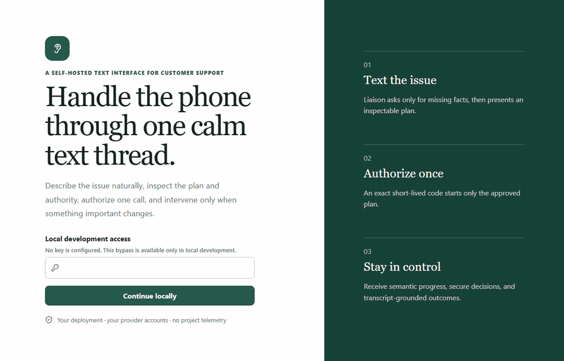
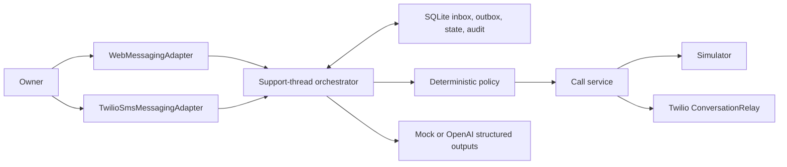

<div align="center">

# Liaison

**An open-source, self-hosted AI phone agent that calls customer support for you — and reports back entirely in text.**

You describe the problem. Liaison writes a plan. You approve it. It makes exactly one call, narrates the whole thing over SMS or a web thread, and asks before it does anything that matters.

[](https://github.com/kaushika05/liaison/actions/workflows/ci.yml)
[](LICENSE)
[](https://nodejs.org)
[](tsconfig.json)
[](#try-it-in-60-seconds)

**[liaison-rho.vercel.app](https://liaison-rho.vercel.app)**



<sub>The full workflow in mock mode — no credentials, no telephone call. Reproduce it with <code>npm run demo:capture</code>.</sub>

</div>

---

## Why this exists

Being on hold is a tax on your time, and it is worse if calling is hard for you — hearing loss, anxiety, a speech difference, a language barrier, a job where you cannot step away for forty minutes.

Hosted AI callers (Pine and friends) solve the waiting. They also mean handing a stranger's server your account details, your recordings, and the authority to agree to things on your behalf. You get a summary afterward and no way to check it.

Liaison is the self-hosted answer. It runs as one Node process on your own machine or VPS, against **your** Twilio and OpenAI accounts. Nothing is sent to a vendor. And its central rule is a design constraint, not a feature:

> **Nothing important ever exists only in audio.** Every warning, request, decision, commitment, and state change reaches you as text you can read, quote, and export.

It ships with a deterministic simulator, so you can run the entire product — intake, planning, authorization, a live "call," approvals, and a grounded outcome report — with **zero API keys and zero charges.**

## Try it in 60 seconds

Requires Node.js 22+. No Twilio account. No OpenAI key. No phone call.

```bash
git clone https://github.com/kaushika05/liaison.git && cd liaison
npm ci
npm run setup -- --defaults --output=.env
npm run dev
```

`setup` generates independent local secrets and prints an access key once — save it. Open `http://localhost:3000`, sign in, and paste this into the thread:

```text
I need Acme support at +12025550123. A replacement shipment never arrived.
The order was placed last Tuesday. I want a replacement with a confirmed delivery date.
```

Liaison will ask for anything missing, hand back an inspectable plan, and wait for you to type `APPROVE PLAN`. It then issues a one-time code; reply `CALL <code>` and the simulated call runs end to end.

Prefer the terminal? `npm run demo:messaging` drives the same path headlessly and exits non-zero if anything regresses.

## How it works

```
you ──► describe the problem in plain language
        │
        ▼
     PLAN v1  ── goal, destination, autonomy mode, authority envelope,
        │        conditional limits, prohibited actions, what's still unknown
        │
   APPROVE PLAN
        │
        ▼
    one-time code ── bound to this plan version, this number, this call mode.
        │             expires in 10 min. editing the plan kills it.
     CALL <code>
        │
        ▼
   ┌─── the call ────────────────────────────────────────────────┐
   │ semantic updates ────────────────► "reached billing"        │
   │ trivial choice   ────────────────► reply A / B / C          │
   │ sensitive or material decision ──► signed single-use web link│
   │ prohibited ──────────────────────► refused. no approval path.│
   └─────────────────────────────────────────────────────────────┘
        │
        ▼
  outcome report ── every claim carries an exact transcript quote,
                    or it does not appear in the report
```

You keep persistent control the entire time: `PAUSE`, `RESUME`, `SAY: <exact words>`, private steering the representative never hears, and `HANGUP` → `HANGUP YES`.

## What makes it different

**Approval is cryptographically scoped, not a button.** Approving a plan mints a random code whose HMAC is stored alongside the exact thread, case, plan version, destination, and call mode. Change the goal, the number, or the autonomy mode and the code stops working. Consuming it is a single transaction, so a replayed code starts nothing.

**Autonomy changes how often it asks, never what it may do.** `ASSIST`, `COPILOT`, and `DELEGATE` are interaction presets. Underneath, every proposed action is scored by deterministic code — not by the model — into one of five tiers:

| Tier | What happens |
| --- | --- |
| `INFORMATIONAL` | You get a one-line update. |
| `LOW_CONSEQUENCE` | Reply `A` / `B` / `C` from SMS or the web. |
| `SENSITIVE` | Authenticated web review only. Never over SMS. |
| `MATERIAL` | Authenticated web review **plus** explicit confirmation. |
| `PROHIBITED` | Refused. There is no path that approves it. |

Purchases, passwords, one-time codes, full SSNs, payment cards, PINs, security answers, recovery codes, new contracts, impersonation, and waiving legal rights are hard-denied in every mode. Emergency, medical, legal, financial, government, debt, employment, immigration, and law-enforcement calls are out of scope by design.

**Reports cannot hallucinate.** Every field in the outcome report must cite an exact quote that still exists in the stored transcript. Fields that fail the check are deleted rather than softened, and "we'll look into it" is downgraded from `RESOLVED` to `PARTIAL` automatically.

**Secrets have a deliberately short life.** Values you allow the agent to say (an order number, say) live only in a process-local map. SQLite gets the label and the delivery rules, never the value. Restart the server and they are gone on purpose. Prohibited credential patterns are stripped before anything is stored, logged, or sent to a model.

**It tells you when it doesn't know.** If Twilio may or may not have accepted a call, Liaison says so, blocks further calls, and asks you to check the dashboard. It does not retry, redial, or guess. There is one active call, a daily cap, and a hard duration ceiling.

## Commands

Case-insensitive, parsed by deterministic code *before* any model sees the message.

| Command | Effect |
| --- | --- |
| `NEW` | Start a new support request. |
| `STATUS` | Thread, case, call, and pending-decision status. |
| `APPROVE PLAN` | Approve the current plan and mint a one-time call code. |
| `CALL <code>` | Start exactly the plan bound to that code. |
| `A` / `B` / `C` | Answer the one pending low-consequence choice. |
| `MODE ASSIST\|COPILOT\|DELEGATE` | Change how often it asks. Never what it may do. |
| `PAUSE` / `RESUME` | Stop or resume autonomous replies. Transcription continues. |
| `SAY: <text>` | Speak your exact words after safety checks. |
| `HANGUP` → `HANGUP YES` | Request and confirm hanging up. |
| `EDIT` / `LINK` | Open the authenticated web app. |
| `CANCEL` | Cancel preparation. Does not silently end a live call. |
| `STOP` / `START` / `HELP` | Messaging consent and help. `STOP` does not hang up. |

## Architecture

One Fastify process owns everything: auth, the messaging orchestrator and its worker, deterministic policy, call supervision, Twilio webhooks and WebSockets, SSE, SQLite, and the React client. No Redis, no external database, no separate worker service.



SQLite is both the system of record and the work queue. Inbound messages are persisted before they are interpreted; outbound intents are persisted before they are sent. Inbound work gets bounded retries and then becomes inspectable dead-letter work. An ambiguous *outbound* failure is deliberately **not** retried — the carrier may already have the message — so the row stays visible for you to judge.

Delivery callbacks arrive late, duplicated, and out of order. A reducer advances state by semantic progression rather than arrival time, so a stale `queued` cannot erase a known failure. Liaison never claims exactly-once carrier delivery, because that does not exist.

More: [Architecture](docs/ARCHITECTURE.md) · [Messaging protocol](docs/MESSAGING_PROTOCOL.md) · [Provider adapters](docs/PROVIDER_ADAPTERS.md) · [Design principles](docs/DESIGN_PRINCIPLES.md)

## Open protocol

Liaison speaks a versioned data contract — the Universal Support Protocol — so the plan, the
decisions, and the outcomes are inspectable by tooling that isn't this app. Zod schemas are
canonical; `npm run protocol:generate` emits JSON Schema 2020-12 into [`protocol/v1/`](protocol/v1/),
and CI fails if the checked-in artifacts drift.

```bash
GET /api/cases/:caseId/execution-plan   # ExecutionPlan: intent, brief, authority, conditional rules
GET /api/attention/:id                  # AttentionRequest: one expiring decision and its tier
GET /api/cases/:caseId/commitments      # Commitment[]: what each party agreed to, with evidence
```

Every one of these is `schema.parse`d at the boundary, so a malformed document throws instead of
shipping. See [protocol/README.md](protocol/README.md).

## Going live

Real SMS and real calls each need **two** switches flipped, plus credentials. That is intentional.

**Deploy** — see [SELF_HOSTING.md](docs/SELF_HOSTING.md) and the [deployment checklist](docs/DEPLOYMENT_CHECKLIST.md).

```bash
cp .env.example .env   # replace every secret, set exact HTTPS/WSS origins
docker compose build && docker compose up -d
```

Production refuses to start on missing secrets, secrets under 32 characters, reused secrets, or plain-HTTP public origins. Put it behind a TLS reverse proxy (`examples/Caddyfile` is a starting point) and keep SQLite on persistent, writable, backed-up storage.

**SMS** — needs `MESSAGING_MODE=twilio_sms`, `ALLOW_REAL_MESSAGING=true`, your owner number in E.164, Twilio credentials, and a Messaging Service SID or SMS sender. Webhooks:

```text
POST /webhooks/twilio/messaging/inbound
POST /webhooks/twilio/messaging/status
```

**Voice** — needs `TELEPHONY_MODE=twilio`, `ALLOW_REAL_CALLS=true`, completed ConversationRelay onboarding, and a voice-capable sender. Callbacks use short-lived signed-token paths under `/webhooks/twilio/{voice,status,conversation-action,conversation-relay}/<token>`.

Twilio signs the exact URL it requests, so `PUBLIC_BASE_URL` / `PUBLIC_WSS_URL` and your proxy must agree on scheme, host, port, and path. Do not disable signature validation to paper over a mismatch. Full walkthrough: [TWILIO_SETUP.md](docs/TWILIO_SETUP.md).

**Models** — `LLM_MODE=openai` with your key enables OpenAI planning, control, and outcome extraction via strict Zod structured outputs. Mock mode stays the default and is fully functional.

## Scripts

| Command | Purpose |
| --- | --- |
| `npm run setup` | Generate `.env`, independent secrets, and safe defaults. |
| `npm run doctor` | Check runtime, config, and database prerequisites. No provider calls. |
| `npm run dev` | Fastify plus Vite dev middleware. |
| `npm run demo:messaging` | Deterministic no-provider vertical slice. |
| `npm run check` | Lint, typecheck, all tests, production build. |
| `npm run test:unit` / `test:integration` / `test:e2e` | Vitest units, integration, Playwright. |
| `npm run protocol:generate` | Emit protocol v1 JSON Schemas and validate examples. |
| `npm run retention` | Delete completed cases past the retention window. |
| `npm start` | Run the production build. |

## Honest limits

Worth reading before you trust it with anything real.

- **One owner.** One SMS number, one browser principal. This is not multi-tenant identity infrastructure.
- **SMS is not strong auth.** Possessing a phone number is weaker than a key, and carriers see the content. Sensitive and material decisions stay in the authenticated web app for exactly that reason.
- **`STOP` cannot recall a sent message.** It records opt-out and refuses future sends; Twilio may already have accepted the last one.
- **Pattern matching misses secrets.** The credential redactor is a safety layer, not a proof.
- **Liaison does not verify phone numbers.** You supply the support line. It checks the format, not who owns it.
- **Audio is processed by your providers.** Liaison does not request recording or retain audio, but Twilio ConversationRelay and its speech vendors necessarily hear the call.
- **Costs shown are estimates, not invoices.** Provider pricing, number rental, A2P registration, taxes, carrier fees, and model tokens are yours.
- **Passing tests are not live-provider validation.** The suite uses mock clients, signed synthetic requests, and the simulator. It never registers a sender, sends a carrier SMS, places a PSTN call, or spends OpenAI credits.

[Security](docs/SECURITY.md) · [Privacy](docs/PRIVACY.md) · [Costs](docs/COSTS.md) · [Roadmap and non-goals](docs/ROADMAP.md)

## Validating a change

```bash
npm run check          # lint + typecheck + 145 tests + production build
npm run test:e2e       # Playwright browser workflow
npm run demo:messaging # deterministic vertical slice
docker build -t liaison:local .
```

CI runs all of it on every push, plus a check that the generated protocol schemas are current.

## Contributing

Contributions are welcome, especially accessibility testing, provider adapters, and adversarial policy cases. Work in mock mode by default — see [CONTRIBUTING.md](CONTRIBUTING.md). Report vulnerabilities privately per [SECURITY.md](SECURITY.md).

## License

[GNU AGPL-3.0-or-later](LICENSE). Personal-instance software: not a hosted SaaS, call center, campaign messenger, or general-purpose autonomous dialer. No warranty.

---

<div align="center">
<sub><b>Keywords:</b> open source AI phone agent · self-hosted voice AI · AI calls customer service for you · Pine alternative · Twilio ConversationRelay · accessible telephony · human-in-the-loop AI · AI customer support automation · TypeScript · SQLite</sub>
</div>
