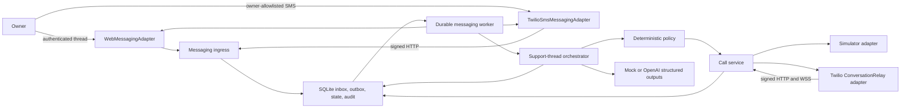
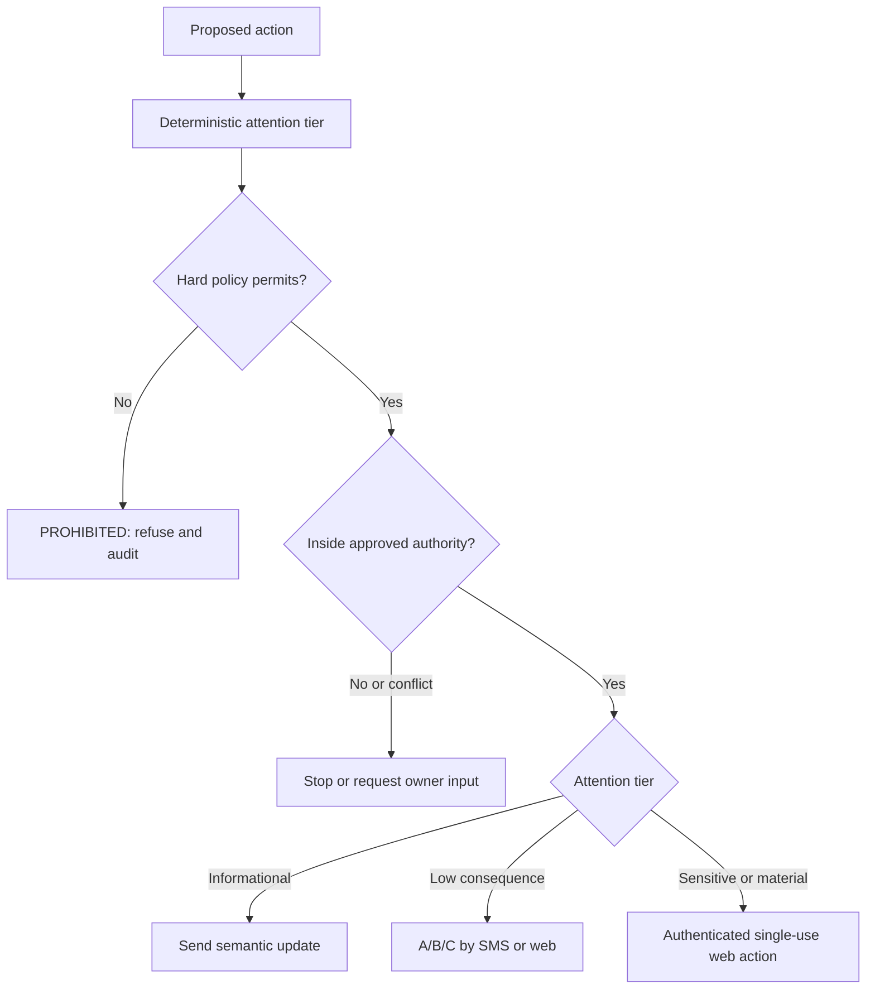
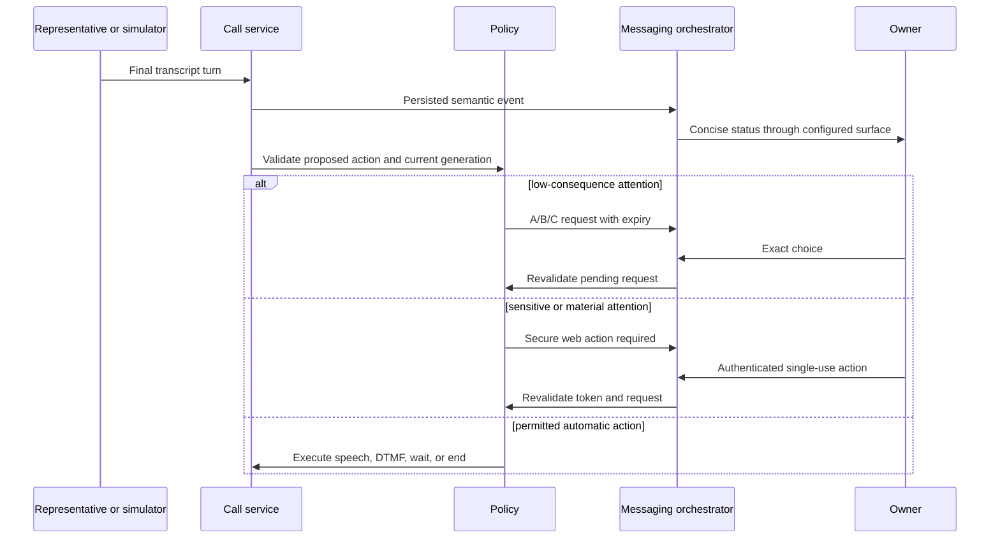

# Architecture

Liaison is a modular monolith for one self-hosted principal. One Node.js process owns Fastify, authentication, the messaging orchestrator and worker, deterministic policy, call supervision, provider callbacks/WebSockets, SSE, SQLite, and static client delivery. It has no network queue, separate worker service, Redis, or external database.

## Provider-neutral messaging

`MessagingAdapter` is intentionally narrow: send one text, optionally validate and parse inbound provider requests, and optionally parse delivery callbacks. `WebMessagingAdapter` supplies the local authenticated thread. `TwilioSmsMessagingAdapter` supplies SMS through the official Twilio SDK. Provider objects do not cross into policy or support-thread state.

Both surfaces enter the same orchestrator. Natural-language interpretation, exact command parsing, missing-information questions, planning, authorization, attention, call control, semantic updates, and outcome formatting are shared behavior rather than duplicated routes.

Inbound Twilio requests follow this boundary:

1. Fastify parses the full form-encoded parameter collection.
2. The adapter validates `X-Twilio-Signature` against the exact configured public callback URL.
3. The application checks account SID, recipient, exact owner E.164 allowlist, opt-out state, SMS-only media count, and provider SID uniqueness.
4. Prohibited credential patterns are replaced with typed redaction markers before persistence, logging, or model input.
5. The message is inserted into the durable inbox and acknowledged with empty TwiML.
6. The worker claims and interprets it asynchronously.

Unauthorized senders are silent by default. An inbound MMS is not downloaded or processed.

## Durable inbox and outbox

The SQLite store is both the system of record and the local work queue. The process writes an inbound envelope before interpretation and writes an outbound intent before calling a provider. Unique provider IDs and idempotency keys prevent duplicate ingestion and duplicate enqueueing. Transactional claims and leases support restart recovery. Inbound interpretation receives at most three claimed attempts before becoming dead-letter work. An ambiguous outbound provider-send error is not automatically retried, because the provider may already have accepted the SMS; the row becomes an inspectable failed/dead-letter delivery instead.

Delivery callbacks are not assumed to be ordered. A deterministic reducer advances semantic delivery state, preserves terminal failure detail, and prevents a late `queued` or `sent` event from erasing a known failure. Provider acceptance remains distinct from handset delivery.

This design gives personal-instance durability without claiming exactly-once behavior from the carrier. A crash after provider acceptance but before the local completion write can leave the result ambiguous; an expired outbound send lease is moved to an inspectable `UNKNOWN` dead letter and is not reclaimed for another send. The application records every callback it observes and never presents local idempotency as proof of exactly-once external delivery.

## Support thread and plan authority

The support thread has an explicit state machine from `IDLE` through issue collection, information requests, drafted/approved planning, call authorization, active call, attention, and one terminal outcome. Illegal transitions fail closed.

The planner produces a versioned `ExecutionPlan` that includes:

- the owner-stated goal and known facts;
- the manually supplied support destination;
- an `AuthorityEnvelope` and conditional rules;
- an autonomy mode (`ASSIST`, `COPILOT`, or `DELEGATE`);
- disclosure metadata, never disclosure values;
- uncertainty and missing-information fields.

Editing material plan content invalidates prior approval and call authorization. Approval creates a random short-lived code whose one-way hash is stored with its exact thread, case, destination, version, and mode binding. Only exact `CALL <code>` consumption can start that plan, once.

## Autonomy and attention

Autonomy is an interaction preset, not additional power. Models can propose a bounded action, but deterministic code assigns its attention tier and evaluates hard policy, plan authority, conditional rules, call generation, duration, duplicate fingerprint, and current attention state immediately before a side effect.

Only one blocking attention request may be pending per call. Superseding or expiring it revokes associated secure-action tokens. SMS can resolve only exact, unambiguous, unexpired low-consequence choices. Sensitive and material actions require the secure web surface; prohibited actions have no approval path.

Secure-action tokens contain at least 32 random bytes. SQLite stores only the token hash and its exact action/thread/case/call/attention binding, expiry, use, and revocation state. Consumption is transactional and single-use.

## Call execution

The existing call service and telephony adapter remain the execution foundation. The browser thread and SMS surface supervise the same call state and event history.

For simulation, deterministic scenario turns enter the state machine. For live Twilio mode, the Calls API receives a short-lived signed voice URL. The returned TwiML connects ConversationRelay to a signed WSS path carrying only a non-secret call reference. HTTP and WSS signatures are validated against exact public URLs; relay setup must match server-owned account and call identity.

Each material finalized remote utterance increments the call generation. A controller proposes one typed action. Pause, interruption, new attention, plan/call termination, or owner control invalidates earlier generations so late output cannot speak or send digits.

There is one active call, a daily cap, a hard maximum duration, no automatic redial, and no call retry.

## Semantic events, commitments, and outcomes

Raw transcript turns remain speaker-labeled and redacted. Stable semantic events express operator-relevant changes such as department reached, hold started, authentication requested, offer made, case number received, deadline received, commitment confirmed, resolution verified, and disconnect. Event-specific deduplication prevents repeated owner notifications.

Commitments have party, status, description, optional amount/deadline/recurrence, and transcript evidence. A commitment cannot be marked confirmed without evidence. Outcome compilation runs once on terminalization, then deterministically validates exact quotes against the stored transcript; unsupported fields are cleared.

## Protocol artifacts

Zod schemas in `src/shared/protocol.ts` are canonical. `npm run protocol:generate` emits JSON Schema 2020-12 documents and validates examples under `protocol/v1`. Protocol parsing occurs at trust boundaries; generated artifacts support inspectability and third-party tooling but do not replace runtime validation.

## Secret lifecycle and failure modes

Temporary disclosure values live only in a process-local map. Persistence, models, events, messages, and stored transcripts receive metadata or redaction markers. An approved execution resolves a value at the last possible moment. Call end, case deletion, shutdown, or process loss clears it; restart deliberately makes it unrecoverable.

Controller timeout or invalid output produces no model speech. The call pauses or exposes an exact-text/hang-up path. Unexpected relay close becomes a real failure. Outbound-message exhaustion becomes a visible delivery failure; Liaison does not silently switch transports. Provider callbacks and terminal events are idempotent because external ordering cannot be trusted.
