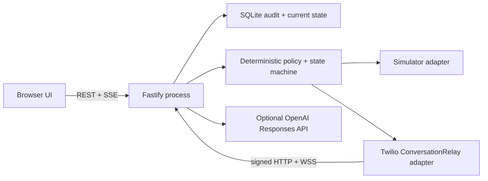
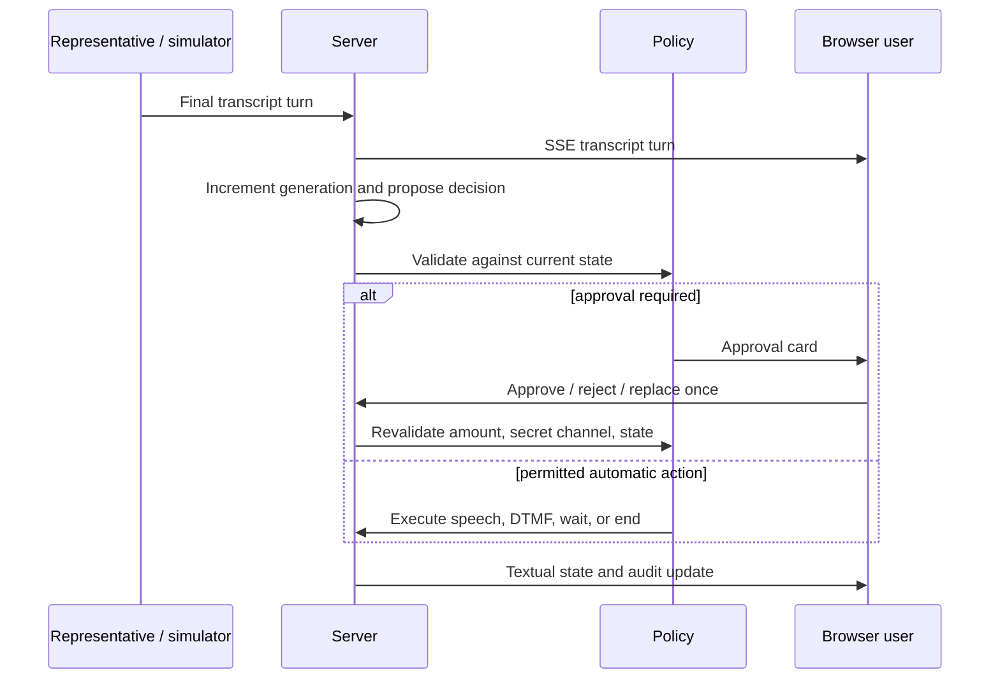

# Architecture

Liaison is intentionally one Node.js process: Fastify owns authentication, policy, telephony webhooks/WebSocket traffic, SSE, SQLite, and static client delivery. One process keeps transaction and stale-generation checks close to the external action, makes single-user deployment inexpensive, and avoids a message broker or distributed lock.

## Request and call flow

The browser posts a manually entered case. Prohibited disclosure values are rejected before the metadata/value pair enters the ephemeral store; only metadata is persisted. The planner receives the narrative and disclosure metadata, never values. A saved plan invalidates earlier approval. Starting requires the exact approved version and no active call.

For simulation, the adapter emits typed deterministic representative turns. For Twilio, the Calls API receives a short-lived signed TwiML URL. TwiML connects ConversationRelay to the signed WSS path with a non-secret call reference. HTTP and WSS signatures are validated against exact configured public URLs. The setup frame must match both account SID and provider call SID.

Each finalized remote utterance increments the call generation. The deterministic simulator or the configured controller proposes one action. Policy checks state transition, pause/approval status, disclosure/consent, DTMF, duration, monetary cap, duplicate execution, and generation immediately before side effects. Interruption, pause, approval, or hang-up increments generation so late model output cannot speak.

## State and event model

`PREPARING → DIALING → CONNECTED` branches through IVR, wait/hold, human disclosure, issue explanation, authentication, negotiation, user approval, and outcome verification. Only explicit table entries are legal. Terminal calls are `COMPLETED` or `FAILED`; neither can transition.

Current call state is stored directly. The append-only event table is an audit trail, not the only reconstruction mechanism. Sequence numbers are monotonic per call/case. Database transactions and conditional approval updates prevent duplicate approval execution. `outcome_reports.call_id` is unique, so outcome compilation is once-only.

SSE sends an initial snapshot, persisted events after `Last-Event-ID`, live event IDs, and heartbeats. The UI reconciles from the authoritative snapshot and does not poll transcript content.

## Planner, controller, and outcome separation

- Planner: narrative to editable brief; mock mode is deterministic, OpenAI mode uses a strict Zod response schema.
- Controller: one bounded decision after a material finalized remote utterance; no tools or raw secrets; recent transcript only.
- Outcome: one terminal compile, then deterministic quote validation. Missing/invalid evidence clears fields, and weak promises cannot yield `RESOLVED`.

## Secret lifecycle and failure modes

Values live in a process-local map keyed by case/card. Persistence, model context, events, SSE, and stored transcripts receive metadata or typed redaction markers. Approved execution resolves the value at the last possible moment. End, case deletion, shutdown, or lost process clears it. Restarting during a call therefore prevents further disclosure and requires safe user intervention.

Controller timeout or invalid output produces no model speech; the call pauses for exact-text control or hang-up. Unexpected relay close becomes a real failure. No automatic call retry or redial occurs. A hard duration timer terminates the call. Provider-side state can arrive in a different order; terminalization and outcome writes are idempotent.
